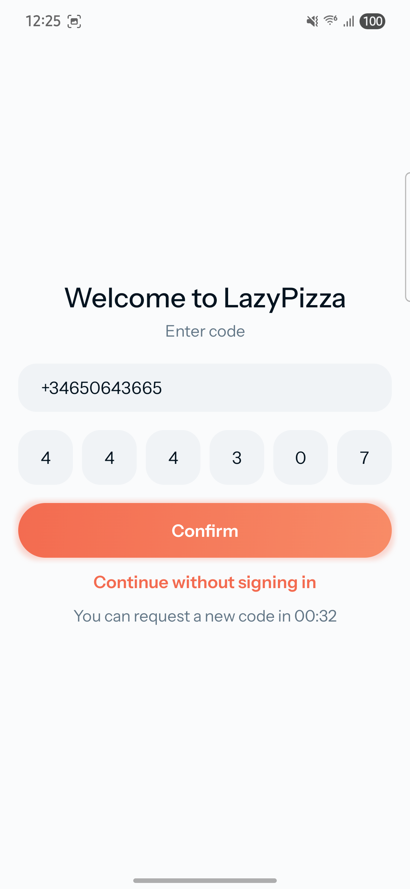
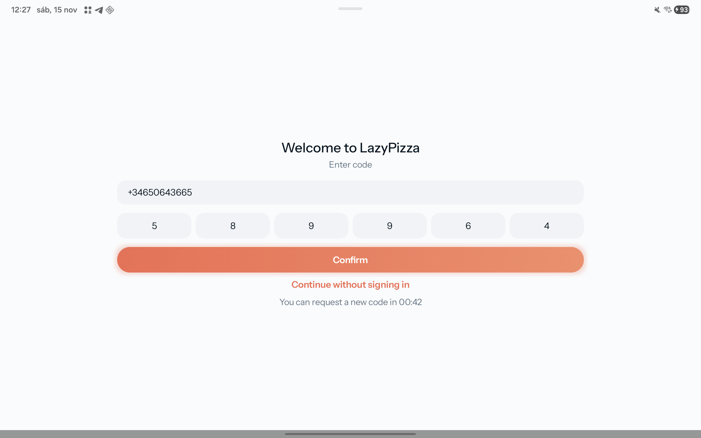
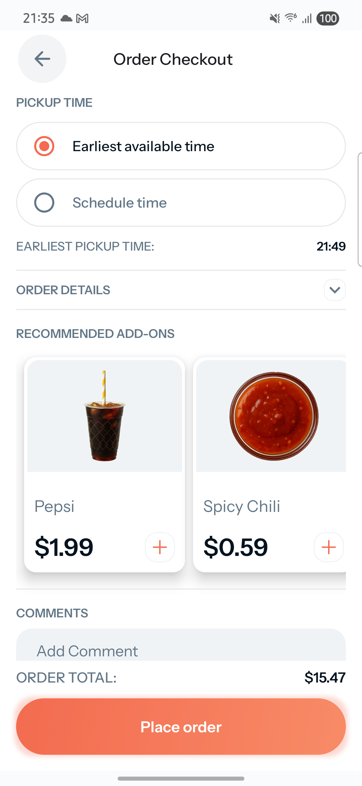
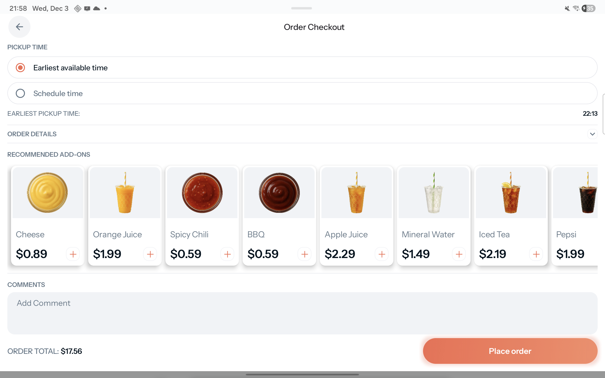

**LazyPizza** is an online pizza delivery app built for the Mobile Dev Campus
by [Phillip Lackner](https://pl-coding.com/campus) as part of the monthly challenge. This app is
made for fun and to improve skills in collaboration by three community
members [@extractive-mana-pulse](https://github.com/extractive-mana-pulse), [@galahseno](https://github.com/galahseno)
and [@icdominguez](https://github.com/icdominguez)

## Project Status

This project was divided in 4 different milestones that were launched every fortnight. Was started
being developed at 1st October and was finished at 29th November.

### 🚨 Latest Features ###

- **Checkout Screen**
  - Shows a pickup time to allow users to choose between Earliest available time or schedule custom time for receiving the order.
  - Displays the order details collapsed at the beginning and it is up to the user to show it.
  - Allows users to select recommended add ons to add directly to the cart.
  - To make the order more customizable there is a comment section where the users can describe the order or place any recommendation.
  - Place order button that connects to firebase and stores the order in firebase
- **History Screen**
  - Now the data is not fake, that screen shows every order placed by the user.
- **General development**
  - Custom navigation bar and navigation rail components were created in order to fit Figma files. 

## 🧑🏽‍💻 Technical implementation

- ✅ Jetpack Compose.
- ✅ MVI architecture (multi-modularized).
- ✅ Compose Navigator.
- ✅ Koin dependency injection.
- ✅ Backend developed by our own. Firebase database and images stored at Cloudinary.
- ✅ Material Design 3 components and theming.

## 🎥 Demo ##

https://github.com/user-attachments/assets/c64dcd4c-cc58-4eb4-9898-4391e7636809

## 📱 Screenshots ##

<details>
  <summary>All Products</summary>

| Mobile                                                                           | Tablet                                                                            | 
|----------------------------------------------------------------------------------|-----------------------------------------------------------------------------------|
|  |  |

</details>

<details>
  <summary>Login</summary>

| Mobile                                                             | Tablet                                                              | 
|--------------------------------------------------------------------|---------------------------------------------------------------------|
|  |  |

</details>

<details>
  <summary>Product Detail</summary>

| Mobile                                                                                | Tablet                                                                                 |
|---------------------------------------------------------------------------------------|----------------------------------------------------------------------------------------|
|  |  |

</details>

<details>
  <summary>Cart</summary>

| Mobile                                                            | Tablet                                                             |
|-------------------------------------------------------------------|--------------------------------------------------------------------|
|  |  |

</details>

<details>
  <summary>Checkout</summary>

| Mobile                                                                    | Tablet                                                                     |
|---------------------------------------------------------------------------|----------------------------------------------------------------------------|
|  |  |

</details>

<details>
  <summary>History</summary>

| Mobile                                                                  | Tablet                                                                   |
|-------------------------------------------------------------------------|--------------------------------------------------------------------------|
|  |  |

</details>

## 🛠️ Setup

For the otp feature we used the telegram GATEWAY api. You can find documentation here: https://core.telegram.org/gateway.

To test this project you need to add this two variables to your local.properties:

```
telegram_base_url="https://gatewayapi.telegram.org"
telegram_api_token="your_token"
```

Just change telegram_api_token with your token and enjoy 🙌

## 🪪 License

This project is an open-source and free to use. Feel free to fork and upload your commits.

## Acknowledge

- Firebase implementation.
- Mastering Koin dependency.
- Data store for user preferences.
- Navigation rail
- Backend development.
- Responsive design.
- Ktlint for consistent code style.
- Cooperating between co-workers.
- Phone numbers validation.
- Ktor Client.
- Telegram GATEWAY api integration to send code to the users and verify them.

---