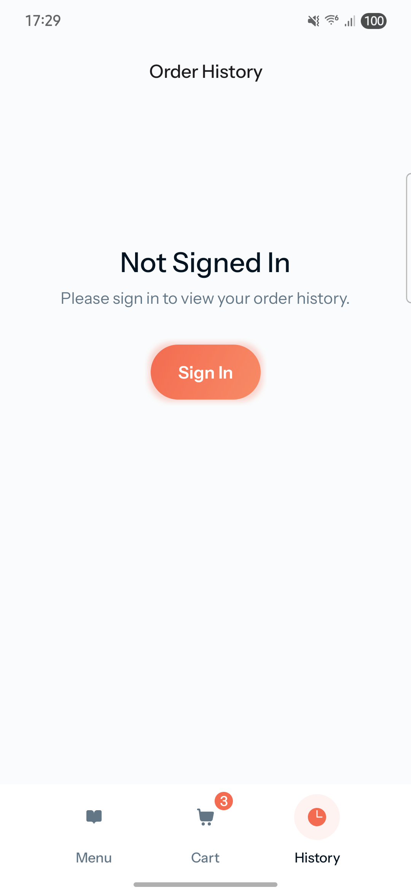
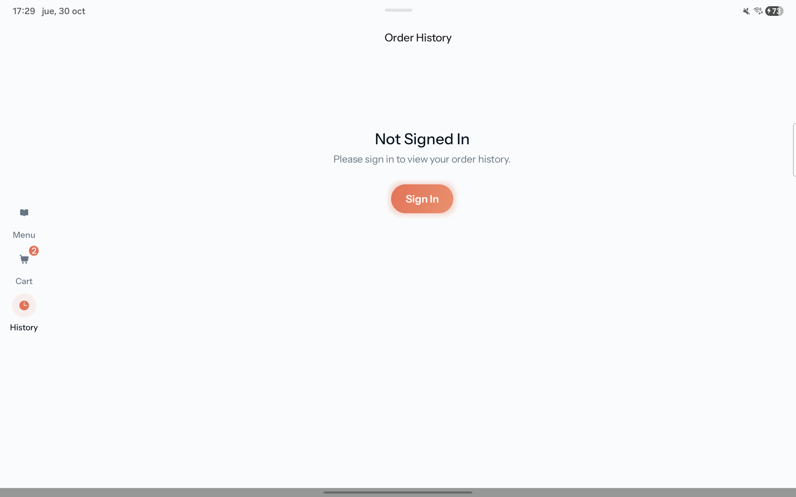

**LazyPizza** is an online pizza delivery app built for the Mobile Dev Campus by [Phillip Lackner](https://pl-coding.com/campus) as part of the monthly challenge. This app is made for fun and to improve skills in collaboration by three community members [@extractive-mana-pulse](https://github.com/extractive-mana-pulse), [@galahseno](https://github.com/galahseno) and [@icdominguez](https://github.com/icdominguez)

## Project Status

This project is divided in 4 different milestones that are launched every fortnight. Was started being developed at 1st October. We are currently working on Milestone 3.

### 🚨 Latest Features ###

- **Cart**
  -  We implemented the model in firebase to store the cart items through out the app. Because of we don't have users logged in we stored the cart id in the device using data store. The model is the following
  

  - Navigation Rail to show the bottom navigation bar at the left in tablet devices.
  - The user receives feedback confirming that the item is successfully added to the cart through a snackbar.
  - The Cart icon in the bottom navigation bar instantly updates its badge to show the current number of items in the cart.
  - If the user changes the product quantity on any product card (using the − 1 + selector), both the badge count and the cart data are updated dynamically.
  - For pizzas, after tapping the Add to Cart button on the Product Details screen, the app returns the user to the main Menu screen so they can continue selecting other products.
- **History**
  -  For the moment shows a "Not Signed In" state. Sign in will be implemented in the  next milestone
- **Consistent code styling with ktlint**
  - We added ktlint support to ensure consistent code style throughout project. This helps keep the code clean and consistent among all team members.

## 🧑🏽‍💻 Technical implementation

- ✅ Jetpack Compose.
- ✅ MVI architecture (multi-modularized).
- ✅ Compose Navigator.
- ✅ Koin dependency injection.
- ✅ Backend developed by our own. Firebase database and images stored at Cloudinary.
- ✅ Material Design 3 components and theming.

## 🎥 Demo ##

https://github.com/user-attachments/assets/8a7d2b22-e5b5-47b1-8c74-cb4713cd838b

## 📱 Screenshots ##

  
All Products

| Mobile                                                                           | Tablet                                                                            | 
|----------------------------------------------------------------------------------|-----------------------------------------------------------------------------------|
|  |  |

  
Product Detail

| Mobile                                                                                | Tablet                                                                                 |
|---------------------------------------------------------------------------------------|----------------------------------------------------------------------------------------|
|  |  |

  
Cart

| Mobile                                                            | Tablet                                                             |
|-------------------------------------------------------------------|--------------------------------------------------------------------|
|  |  |

  
History

| Mobile                                                                  | Tablet                                                                   |
|-------------------------------------------------------------------------|--------------------------------------------------------------------------|
|  |  |

## 🪪 License

This project is an open-source and free to use. Feel free to fork and upload your commits.

## Acknowledge

- Firebase implementation.
- Mastering Koin dependency.
- Data store for user preferences.
- Navigation rail
- Backend development.
- Responsive design.
- Ktlint for consistent code style.
- Cooperating between co-workers.

---